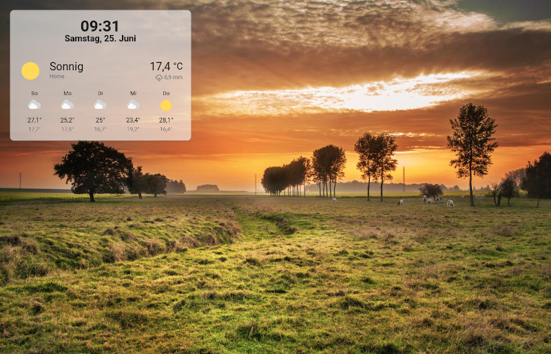

# WallPanel

[](https://github.com/hacs/integration)
[](https://github.com/j-a-n/lovelace-wallpanel/releases)
[](https://github.com/j-a-n/lovelace-wallpanel/stargazers)

[](https://j-a-n.github.io/lovelace-wallpanel/ "Go to WallPanel documentation")


🖼️ **Wall panel mode for your Home Assistant Dashboards.**  

WallPanel is a configurable extension that features:

- Photo and video slideshow screensaver
- Show dashboard views, cards and badges of your choice on top of the images.
- Full-screen mode
- Hide the side and or top bar 
- Screen wake lock
- Motion detection

You can use images and videos from the following sources:

- Home Assistant Media-source
- Immich
- Home Assitant entities with entity_picture attribute
- Full websites as iframe
- Unsplash



## Installation

* Search for `WallPanel` in the Home Assistant Community Store
* Click on the repository
* Click the `Download` button
* You can now select a special version if required
* Click on `Download`

## Quick Start
After [Installation](#installation) you can enable wallpanel for a dashboard.
To do this, add a wallpanel configuration to your Home Assistant dashboard configuration yaml (raw config).

* Navigate to the dashboard.
* Click Overview in your sidebar.
* Click the three dots menu (top-right) and click on Edit Dashboard.
* Click the three dots menu again and click on Raw configuration editor.
* Add the `wallpanel` configuration above anything else.

```yaml
wallpanel:
  enabled: true
  hide_toolbar: false
  hide_sidebar: true
  fullscreen: false
  idle_time: 10
```

After saving and closing the dashboard configuration, WallPanel should now be active for this dashboard.
The sidebar should be hidden and the screensaver should start after an idle time of 10 seconds.

## Documentation
Further information can be found in the [WallPanel Documentation](https://j-a-n.github.io/lovelace-wallpanel/).

## Credits
Thanks to Unsplash and to all the photographers for sharing their great photos!
Many thanks to Openstreetmap for providing the excellent Nominatim search engine!
Thanks to Jacob Seidelin for exif-js!

This project is inspired by:
- https://github.com/tcarlsen/lovelace-screensaver
- https://gist.github.com/ciotlosm/1f09b330aa5bd5ea87b59f33609cc931
- https://github.com/richtr/NoSleep.js
- https://github.com/madeInLagny/mil-no-sleep

## Reviews / Tutorials
- [SmartHomeScene - WallPanel: Home Assistant Screensaver for your wall-mounted control panel](https://smarthomescene.com/guides/wallpanel-home-assistant-screensaver-for-your-wall-mounted-control-panel)
- [Smart Home Pursuites - Install Fully-Kiosk + Wallpanel in Home Assistant for Fire Tablets](https://smarthomepursuits.com/fire-tablet-fully-kiosk-screensaver-home-assistant/)

## Videos
- [YouTube: Next Level Tablet Dashboard 🌅 mit lovelace-wallpanel 🤩 (🇩🇪)](https://www.youtube.com/watch?v=_KTyYIznzMY)
- [YouTube: So wird dein Home Assistant Wallpanel zum Kunstobjekt! (🇩🇪)](https://youtu.be/ohBRmoOTKW0?si=S1Yl_Mmj7jXKLPpC)
